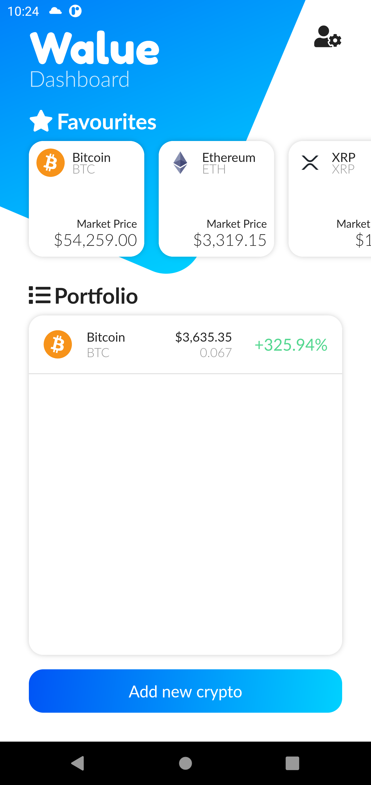
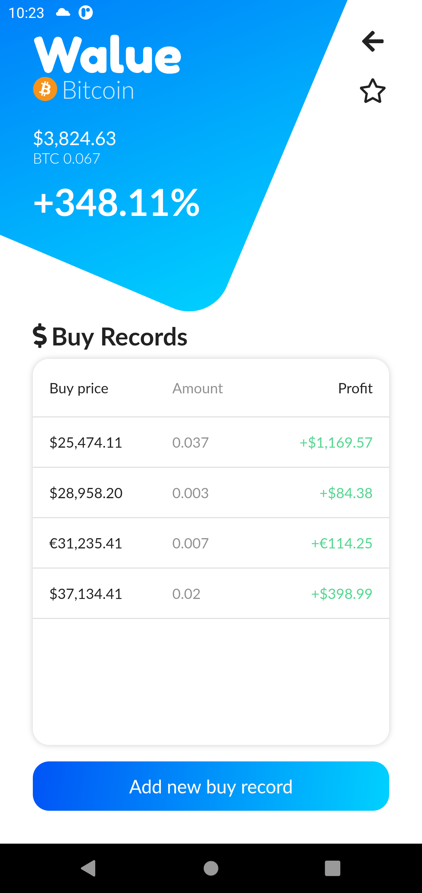
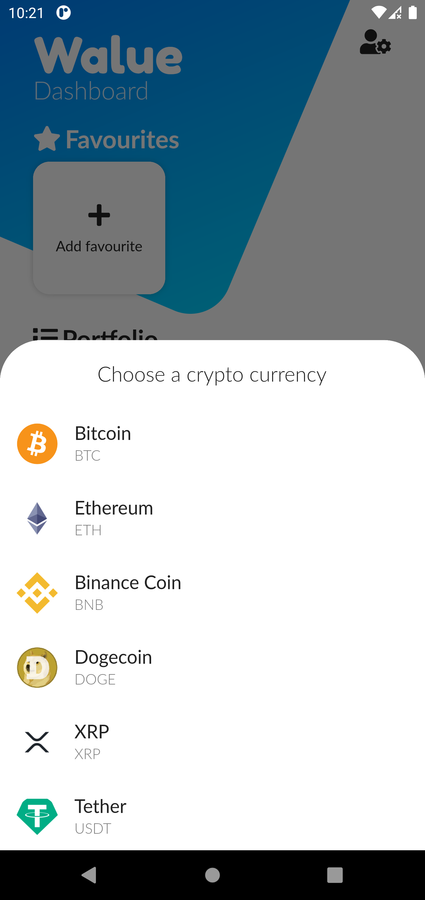
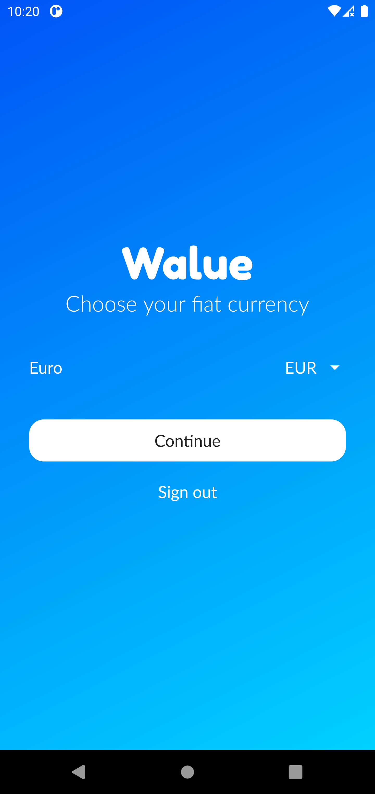
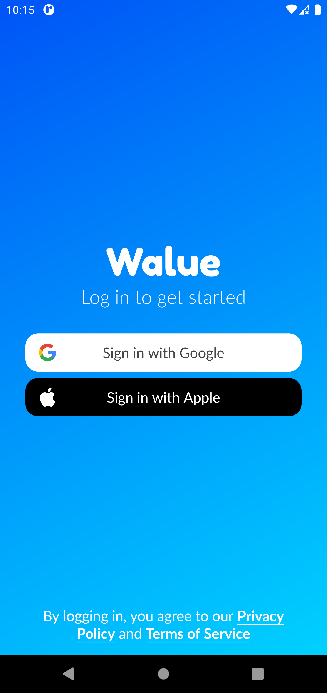

# Walue

Cryptocurrency portfolio tracker. This app (and backend using Firebase) was made for a client who wanted to track his cryptocurrency portfolio. Unfortunately, the client didn't want to continue with the project, so I decided to make it open source after 3 years to serve as an example of an app I built from start to finish with design created in Figma. Feel free to use it as a learning material.

## Features

- [x] User accounts and data storage using Firebase Authentication and Firestore
- [x] Cryptocurrency loading from CoinGecko API to Firestore via a Cloud Function - to not overload the API
- [x] Real-time cryptocurrency prices
- [x] Fiat currency selection and conversion using Exchange Rate Host API
- [x] Add, edit, and delete cryptocurrencies and transactions
- [x] Portfolio value calculation
- [x] Responsive design
- [x] Dark mode
- [x] User onboarding
- [x] User settings

## Screenshots

[All Screenshots](walue_branding/screenshots)

## Tech Stack

- Flutter (Riverpod, Hooks)
- Firebase (Authentication, Firestore, Cloud Functions)
- CoinGecko API
- Exchange Rate Host API

## Repository Structure

- `walue_app` - Flutter app
- `walue_branding` - Screenshots, icons and other branding assets
- `walue_functions` - Firebase Cloud Functions
- `walue_scripts` - Scripts to quickly make changes to the firestore database as needed
- `walue_website` - Website for the app (not implemented)
